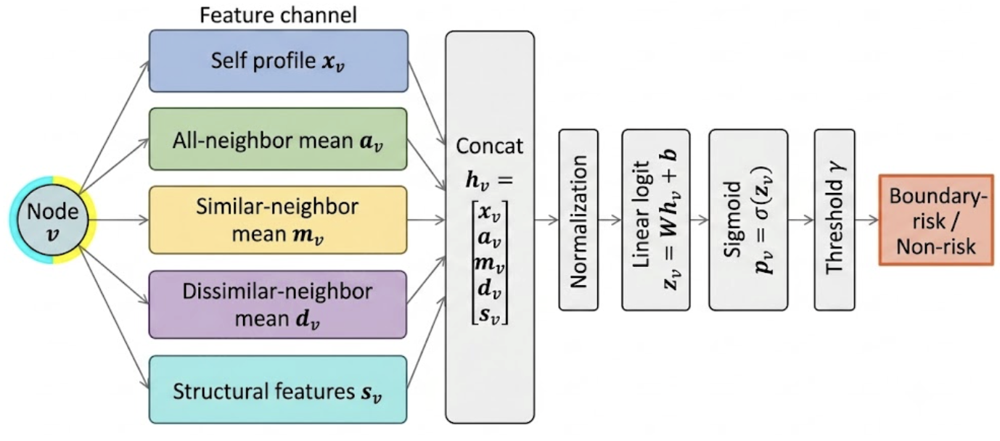
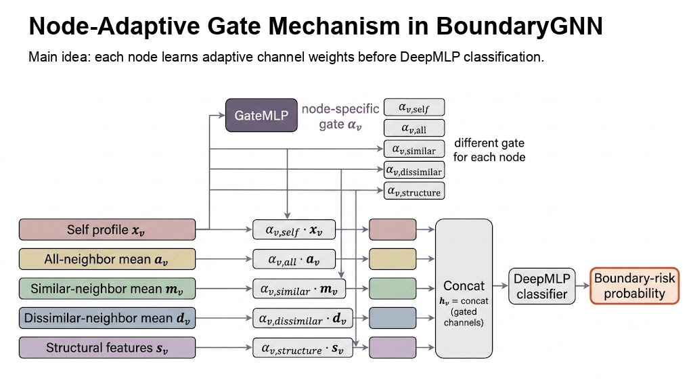
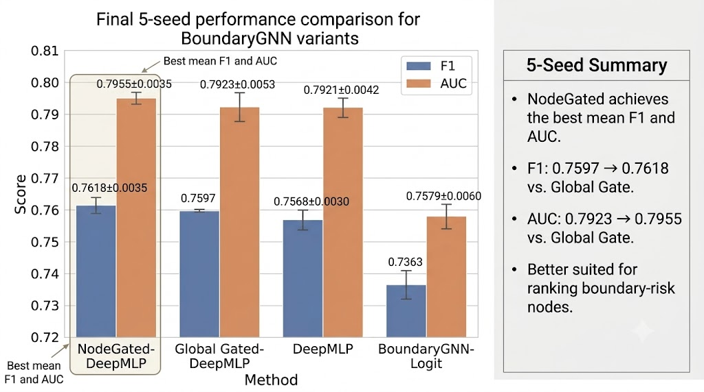

# ContextScope: Node-Adaptive BoundaryGNN for Social Boundary-Risk Detection

本项目基于公开的 SNAP Google+ Circles 数据集，构建了一个新的社交网络图学习任务：
**社交边界风险节点识别**。它不做传统的社区发现或好友推荐，而是预测一个用户是否处在多个社交圈层的边界位置，是否可能把一个圈层的信息暴露到另一个圈层。

项目从轻量可解释的 **BoundaryGNN-Logit** 出发：先根据用户画像相似度把好友边划分为同质边和异质边，再分别聚合不同类型邻居的信息，预测节点的边界风险。在此基础上进一步扩展到 **NodeGated BoundaryGNN**，为每个节点学习自己的通道权重，让不同节点自适应选择 self、all-neighbor、similar-neighbor、dissimilar-neighbor 和 structure 信息。



## 项目亮点

- **新任务**：将 Google+ Circles 从“社交圈发现”转化为“边界风险节点识别”任务。
- **弱监督标签构造**：利用公开 circle 标注构造边界风险标签，不需要人工重新标注。
- **边分型聚合**：基于画像 Jaccard 相似度区分同质边和异质边，显式建模跨圈层暴露。
- **节点级通道门控**：为每个节点学习不同的五通道权重，缓解固定拼接带来的通道冗余。
- **可解释模型**：输出不只是分类结果，还能解释节点风险来自多圈层成员关系、异质邻居比例和跨圈层连接。
- **完整对比实验**：与 3 个轻量级 baseline 对比，并提供容量扩展、消融、门控和 5 seed 稳定性实验。

## 可视化总览

**Node-Adaptive Gate**



**Final 5-Seed Result**



更多展示图已整理在 `docs/figures/presentation/`，包括任务构造、标签构造、主结果、容量扩展、消融实验和全局通道门控图。

## 数据集

使用的公开数据集为 SNAP **Social circles: Google+**：

- 数据集页面：<https://snap.stanford.edu/data/ego-Gplus.html>
- 原始论文：J. McAuley and J. Leskovec, *Learning to Discover Social Circles in Ego Networks*, NIPS 2012.
- 原始内容：ego-network edges、匿名二值画像特征、circle 标注、ego 用户特征等。

本项目没有直接使用原始 circle prediction 任务，而是重新构造了一个弱监督的 boundary-risk node detection benchmark。

### 构造后的数据规模

| 统计项 | 数量 |
|---|---:|
| 原始 Google+ ego networks | 132 |
| 实际参与实验的 ego networks | 122 |
| 原始压缩包大小 | 393 MB |
| 解压后数据大小 | 2.4 GB |
| ego 子图节点实例总数 | 254,556 |
| ego 子图边实例总数 | 26,954,330 |
| 有标签节点样本 | 39,204 |
| 正样本 | 22,261 |
| 负样本 | 16,943 |
| 训练集 | 23,523 |
| 验证集 | 7,847 |
| 测试集 | 7,834 |

其中，132 个原始 ego 网络中有 10 个因为有效标签过少或无法稳定划分训练/验证/测试集而被过滤，最终使用 122 个 ego 网络。

## 任务定义

给定一个 ego network：

```text
G = (V, E), X, C
```

其中：

- `V` 是用户节点；
- `E` 是好友关系；
- `X` 是匿名用户画像特征；
- `C` 是 Google+ circle 标注。

目标是对每个可标注节点预测：

```text
boundary_risk(v) ∈ {0, 1}
```

如果一个节点属于多个 circle，或者它连接了多个不属于自己 circle 的邻居，则它更可能是边界风险节点。

## 标签构造

原始数据没有直接提供“边界风险”标签，所以本项目从 circle 标注中构造弱监督标签。一个节点被标为正样本的主要条件包括：

```text
1. 节点属于多个 circle；
2. 或者节点连接了多个外部 circle，并且外部邻居比例较高。
```

代码位置：

- `contextscope/data.py`
- 函数：`derive_boundary_labels`

在最终 CUDA 实验中，验证集只用于选择分类阈值，不参与模型训练，也不并入测试集。

## 方法：BoundaryGNN-Logit

BoundaryGNN-Logit 是一个轻量级、可解释的边界感知图表示方法。整体流程如下：

```text
Google+ Ego Network
→ 构造边界风险标签
→ 计算好友画像相似度
→ 划分同质边和异质边
→ 分别聚合不同类型邻居
→ 拼接节点表示
→ Logistic 分类器预测边界风险
```

### 画像相似度

对每条好友边 `(u, v)`，计算两个用户画像特征集合的 Jaccard 相似度：

```text
sim(u, v) = |P_u ∩ P_v| / |P_u ∪ P_v|
```

然后根据相似度阈值划分边类型：

```text
sim(u, v) 高 → Similar Edge
sim(u, v) 低 → Dissimilar Edge
```

### 边界感知聚合

对每个节点 `v`，构造 5 组特征：

```text
Self Profile
All-Neighbor Mean
Similar-Neighbor Mean
Dissimilar-Neighbor Mean
Structural Features
```

最终节点表示为：

```text
h_v = concat(x_v, all_v, similar_v, dissimilar_v, s_v)
```

其中：

- `x_v`：节点自身画像；
- `all_v`：全部邻居平均画像；
- `similar_v`：同质邻居平均画像；
- `dissimilar_v`：异质邻居平均画像；
- `s_v`：度数、聚类系数、同质/异质边比例等结构特征。

最后使用 Logistic 分类器输出：

```text
p_v = sigmoid(W h_v + b)
```

## 对比方法

默认实验只保留 3 个 baseline，加上我们的方法：

| 方法 | 说明 |
|---|---|
| `ProfileLogit` | 只使用用户画像特征的 Logistic baseline |
| `StructureLogit` | 只使用图结构特征的 Logistic baseline |
| `ProfileStructureLogit` | 使用画像特征和结构特征，但不做邻居消息聚合 |
| `BoundaryGNN-Logit` | 我们的方法，使用同质/异质边分型后的边界感知聚合 |

## 实验结果

最终结果来自全量 Google+ Circles 实验，运行设备为 CUDA。

| Method | Accuracy | Precision | Recall | F1 | AUC |
|---|---:|---:|---:|---:|---:|
| BoundaryGNN-Logit | 0.7821 | 0.7112 | 0.8202 | 0.7379 | 0.7592 |
| StructureLogit | 0.7404 | 0.6698 | 0.8359 | 0.7140 | 0.7199 |
| ProfileStructureLogit | 0.7421 | 0.6587 | 0.8133 | 0.7041 | 0.6704 |
| ProfileLogit | 0.6529 | 0.5986 | 0.8983 | 0.6828 | 0.5301 |

结果文件：

```text
outputs/report_gplus_full_main_cuda.json
outputs/report_gplus_full_main_cuda.log
```

## 扩展实验：消融与模型容量

为了避免实验只停留在“一个方法和几个 baseline”的层面，项目还支持两类扩展实验。

### 消融实验

打开 `--include-ablations` 后，会额外评估以下变体：

| 消融项 | 去掉的模块 | 用途 |
|---|---|---|
| `BoundaryGNN-w/o-All` | 全部邻居聚合 | 检验普通邻居平均是否必要 |
| `BoundaryGNN-w/o-Similar` | 同质邻居聚合 | 检验相似关系通道是否必要 |
| `BoundaryGNN-w/o-Dissimilar` | 异质邻居聚合 | 检验跨圈层桥接通道是否必要 |
| `BoundaryGNN-w/o-Structure` | 结构特征 | 检验度数、聚类系数、边比例等结构信息是否必要 |
| `BoundaryGNN-w/o-EdgeTyping` | 同质/异质边分型 | 检验画像相似度边分型是否带来增益 |

这些消融项用于回答：

```text
BoundaryGNN-Logit 的提升来自哪里？
是来自更多特征，还是来自同质/异质边分型设计？
```

### 模型容量分析

打开 `--include-mlp` 后，会额外评估四个更大参数量的预测头：

| 模型 | 说明 |
|---|---|
| `BoundaryGNN-MLP-128` | 在 BoundaryGNN 表示后接一层 128 hidden units 的 MLP |
| `BoundaryGNN-MLP-512` | 在 BoundaryGNN 表示后接一层 512 hidden units 的 MLP |
| `BoundaryGNN-DeepMLP-1024x512` | 两层 MLP，hidden dimensions 为 1024 和 512 |
| `BoundaryGNN-DeepMLP-2048x1024` | 两层 MLP，hidden dimensions 为 2048 和 1024 |

这部分用于说明：

```text
性能提升是否只是因为模型参数更多？
更大 MLP 是否一定优于轻量级 BoundaryGNN-Logit？
```

扩展实验命令：

```bash
python3 -m contextscope \
  --data-dir data/gplus \
  --logistic-epochs 60 \
  --device cuda \
  --include-ablations \
  --include-mlp \
  --output outputs/report_gplus_full_extended_cuda.json
```

扩展实验报告会额外输出 `model_info` 字段，记录每个模型的平均输入维度和参数量。控制台也会打印 `Model size summary`。

### 大模型容量实验结果

在 RTX 4080 上使用 `--logistic-epochs 80 --include-mlp` 重新运行全量容量实验，得到如下结果：

| Method | Accuracy | Precision | Recall | F1 | AUC | Avg Params |
|---|---:|---:|---:|---:|---:|---:|
| `BoundaryGNN-DeepMLP-2048x1024` | 0.8152 | 0.7383 | 0.8058 | 0.7554 | 0.7954 | 2,612,712 |
| `BoundaryGNN-DeepMLP-1024x512` | 0.8102 | 0.7389 | 0.8078 | 0.7542 | 0.7895 | 782,068 |
| `BoundaryGNN-MLP-512` | 0.8080 | 0.7344 | 0.8105 | 0.7524 | 0.7902 | 128,379 |
| `BoundaryGNN-MLP-128` | 0.7984 | 0.7338 | 0.8127 | 0.7487 | 0.7811 | 32,095 |
| `BoundaryGNN-Logit` | 0.7799 | 0.7041 | 0.8192 | 0.7367 | 0.7600 | 248 |
| `StructureLogit` | 0.7409 | 0.6728 | 0.8342 | 0.7140 | 0.7219 | 8 |
| `ProfileStructureLogit` | 0.7487 | 0.6601 | 0.8019 | 0.7033 | 0.6722 | 68 |
| `ProfileLogit` | 0.6519 | 0.5978 | 0.8972 | 0.6819 | 0.5298 | 61 |

结果文件：

```text
outputs/report_gplus_full_big_mlp_cuda.json
outputs/report_gplus_full_big_mlp_cuda.log
```

### 高参数模型消融结果

为了检验大容量预测头下各个 BoundaryGNN 组件是否仍然有效，本项目还使用最强的 `BoundaryGNN-DeepMLP-2048x1024` 作为统一预测头，对完整表示和五个消融表示分别训练：

```bash
python3 -m contextscope \
  --data-dir data/gplus \
  --logistic-epochs 80 \
  --device cuda \
  --include-mlp-ablations \
  --output outputs/report_gplus_full_big_mlp_ablation_cuda.json
```

| Method | Accuracy | Precision | Recall | F1 | AUC | Avg Params |
|---|---:|---:|---:|---:|---:|---:|
| `BoundaryGNN-DeepMLP-2048x1024` | 0.8153 | 0.7384 | 0.8058 | 0.7554 | 0.7953 | 2,612,712 |
| `BoundaryGNN-DeepMLP-2048x1024-w/o-All` | 0.7863 | 0.7169 | 0.8270 | 0.7449 | 0.7811 | 2,489,966 |
| `BoundaryGNN-DeepMLP-2048x1024-w/o-Similar` | 0.8110 | 0.7333 | 0.8247 | 0.7581 | 0.7951 | 2,489,966 |
| `BoundaryGNN-DeepMLP-2048x1024-w/o-Dissimilar` | 0.8027 | 0.7317 | 0.8184 | 0.7523 | 0.7955 | 2,489,966 |
| `BoundaryGNN-DeepMLP-2048x1024-w/o-Structure` | 0.7998 | 0.7208 | 0.8121 | 0.7461 | 0.7747 | 2,598,376 |
| `BoundaryGNN-DeepMLP-2048x1024-w/o-EdgeTyping` | 0.8078 | 0.7354 | 0.8213 | 0.7548 | 0.7962 | 2,367,220 |

高参数消融显示：

- 去掉 `All-Neighbor Mean` 后 F1 从 0.7554 降到 0.7449，说明普通邻居上下文仍然重要。
- 去掉 `Structural Features` 后 AUC 从 0.7953 降到 0.7747，说明结构位置对边界风险识别很关键。
- 去掉 `Dissimilar-Neighbor Mean` 后 F1 小幅下降，说明异质邻居通道有贡献，但贡献幅度不如全部邻居和结构特征。
- 去掉 `Similar-Neighbor Mean` 后 F1 略升，说明相似邻居通道在大模型下可能存在冗余或轻微噪声。
- 去掉 `EdgeTyping` 后 F1 基本持平、AUC 略高，说明边分型模块的主要价值更偏向可解释建模，而不是在所有容量设置下都带来单调性能提升。

结果文件：

```text
outputs/report_gplus_full_big_mlp_ablation_cuda.json
outputs/report_gplus_full_big_mlp_ablation_cuda.log
```

### 通道门控改进

为缓解多通道聚合之间的信息冗余，项目进一步实现了通道门控版本：

```text
ChannelGated-BoundaryGNN
```

该模型在拼接前为五个通道学习可训练权重：

```text
h_v = concat(
  alpha_self * self,
  alpha_all * all_neighbor,
  alpha_similar * similar_neighbor,
  alpha_dissimilar * dissimilar_neighbor,
  alpha_structure * structure
)
```

命令：

```bash
python3 -m contextscope \
  --data-dir data/gplus \
  --logistic-epochs 80 \
  --device cuda \
  --include-gated-mlp \
  --output outputs/report_gplus_full_gated_mlp_cuda.json
```

全量结果：

| Method | Accuracy | Precision | Recall | F1 | AUC | Avg Params |
|---|---:|---:|---:|---:|---:|---:|
| `BoundaryGNN-GatedDeepMLP-2048x1024` | 0.8171 | 0.7472 | 0.8071 | 0.7588 | 0.7942 | 2,612,717 |
| `BoundaryGNN-DeepMLP-2048x1024` | 0.8153 | 0.7384 | 0.8058 | 0.7554 | 0.7954 | 2,612,712 |
| `BoundaryGNN-Logit` | 0.7799 | 0.7041 | 0.8192 | 0.7367 | 0.7600 | 248 |

学习到的平均通道门控权重：

| Channel | Gate |
|---|---:|
| `self` | 1.002 |
| `all` | 1.003 |
| `similar` | 0.997 |
| `dissimilar` | 0.998 |
| `structure` | 0.998 |

结果表明，通道门控将 F1 从 0.7554 提升到 0.7588。`similar` 通道的 gate 略低于 `self` 和 `all`，说明相似邻居信息不是完全无效，而是在大模型中存在轻微冗余，需要被自适应压低。

结果文件：

```text
outputs/report_gplus_full_gated_mlp_cuda.json
outputs/report_gplus_full_gated_mlp_cuda.log
```

### 节点级动态门控改进

全局通道门控只能为所有节点学习同一组权重。为了进一步处理“某些节点需要相似邻居通道、某些节点不需要”的异质性，项目实现了节点级动态门控：

```text
alpha_v = GateMLP(concat(self_v, all_v, similar_v, dissimilar_v, structure_v))

h_v = concat(
  alpha_v,self * self_v,
  alpha_v,all * all_neighbor_v,
  alpha_v,similar * similar_neighbor_v,
  alpha_v,dissimilar * dissimilar_neighbor_v,
  alpha_v,structure * structure_v
)
```

其中 `alpha_v` 是每个节点自己的五通道权重，初始化时所有 gate 都等于 1，因此模型初始状态等价于普通 `BoundaryGNN-DeepMLP-2048x1024`，随后再学习节点级通道选择。

运行命令：

```bash
python3 -m contextscope \
  --data-dir data/gplus \
  --seed 7 \
  --logistic-epochs 80 \
  --device cuda \
  --include-gated-mlp \
  --include-node-gated-mlp \
  --output outputs/report_gplus_full_node_gated_cuda.json
```

单 seed 结果：

| Method | Accuracy | Precision | Recall | F1 | AUC | Avg Params |
|---|---:|---:|---:|---:|---:|---:|
| `BoundaryGNN-NodeGatedDeepMLP-2048x1024` | 0.8108 | 0.7463 | 0.8214 | 0.7595 | 0.7992 | 2,645,323 |
| `BoundaryGNN-GatedDeepMLP-2048x1024` | 0.8171 | 0.7473 | 0.8087 | 0.7595 | 0.7943 | 2,612,717 |
| `BoundaryGNN-DeepMLP-2048x1024` | 0.8153 | 0.7384 | 0.8058 | 0.7554 | 0.7954 | 2,612,712 |
| `BoundaryGNN-Logit` | 0.7803 | 0.7041 | 0.8196 | 0.7369 | 0.7600 | 248 |

节点级 gate 的单 seed 平均权重：

| Method | self gate | all gate | similar gate | dissimilar gate | structure gate |
|---|---:|---:|---:|---:|---:|
| `BoundaryGNN-GatedDeepMLP-2048x1024` | 1.002 | 1.003 | 0.997 | 0.998 | 0.998 |
| `BoundaryGNN-NodeGatedDeepMLP-2048x1024` | 0.952 | 1.017 | 0.898 | 0.912 | 0.923 |

结果显示，节点级动态门控没有显著增加参数量，但能明显改变通道使用方式：`similar` 和 `dissimilar` 通道被更强地自适应压低，`all` 通道被保留得更高。相比全局 gate，它的 AUC 从 0.7943 提升到 0.7992，说明节点级通道选择更有利于风险排序。

结果文件：

```text
outputs/report_gplus_full_node_gated_cuda.json
outputs/report_gplus_full_node_gated_cuda.log
```

### 多随机种子稳定性实验

为了验证结果不是单个随机划分带来的偶然提升，项目进一步在 RTX 4080 上并行运行 5 个随机种子：

```bash
for seed in 1 3 5 7 9; do
  python3 -m contextscope \
    --data-dir data/gplus \
    --seed "$seed" \
    --logistic-epochs 80 \
    --device cuda \
    --include-gated-mlp \
    --include-node-gated-mlp \
    --output "outputs/node_multiseed/report_seed_${seed}_node_gated.json" &
done
wait
python3 scripts/summarize_multiseed.py \
  outputs/node_multiseed/report_seed_*_node_gated.json \
  --output-json outputs/node_multiseed/summary_node_gated.json \
  --output-md outputs/node_multiseed/summary_node_gated.md
```

5 seed 汇总结果如下：

| Method | Runs | F1 mean | F1 std | AUC mean | AUC std | Accuracy mean | Params |
|---|---:|---:|---:|---:|---:|---:|---:|
| `BoundaryGNN-NodeGatedDeepMLP-2048x1024` | 5 | 0.7618 | 0.0035 | 0.7955 | 0.0035 | 0.8061 | 2,645,323 |
| `BoundaryGNN-GatedDeepMLP-2048x1024` | 5 | 0.7597 | 0.0007 | 0.7923 | 0.0053 | 0.8087 | 2,612,717 |
| `BoundaryGNN-DeepMLP-2048x1024` | 5 | 0.7568 | 0.0030 | 0.7921 | 0.0042 | 0.8074 | 2,612,712 |
| `BoundaryGNN-Logit` | 5 | 0.7363 | 0.0060 | 0.7579 | 0.0060 | 0.7756 | 248 |
| `StructureLogit` | 5 | 0.7184 | 0.0066 | 0.7208 | 0.0048 | 0.7517 | 8 |
| `ProfileStructureLogit` | 5 | 0.7046 | 0.0036 | 0.6699 | 0.0083 | 0.7298 | 68 |
| `ProfileLogit` | 5 | 0.6780 | 0.0032 | 0.5387 | 0.0239 | 0.6556 | 61 |

5 seed 结果表明，`BoundaryGNN-NodeGatedDeepMLP-2048x1024` 取得最高平均 F1 和最高平均 AUC。相比全局门控，它牺牲了少量 accuracy，但提高了 recall、F1 和 AUC，更适合作为边界风险节点的排序与筛查模型。

通道门控的 5 seed 平均权重如下：

| Method | self gate | all gate | similar gate | dissimilar gate | structure gate |
|---|---:|---:|---:|---:|---:|
| `BoundaryGNN-GatedDeepMLP-2048x1024` | 1.002 | 1.003 | 0.997 | 0.998 | 0.998 |
| `BoundaryGNN-NodeGatedDeepMLP-2048x1024` | 0.944 | 1.017 | 0.895 | 0.919 | 0.937 |

结果文件：

```text
outputs/node_multiseed/report_seed_1_node_gated.json
outputs/node_multiseed/report_seed_3_node_gated.json
outputs/node_multiseed/report_seed_5_node_gated.json
outputs/node_multiseed/report_seed_7_node_gated.json
outputs/node_multiseed/report_seed_9_node_gated.json
outputs/node_multiseed/summary_node_gated.json
outputs/node_multiseed/summary_node_gated.md
outputs/node_multiseed/run_node_multiseed_parallel.log
```

### 软标签探索实验

项目还实现了一个 soft-label 版本，用连续边界风险分数替代纯 `0/1` 训练目标。该分数由 `bridge_scores` 归一化得到，并用 hard label 锚定：

```text
positive target: [0.55, 1.00]
negative target: [0.05, 0.45]
```

评估时仍然使用原始 hard label、验证集阈值和测试集指标，因此结果可以和前面的 hard-label 方法直接对比。

运行命令：

```bash
python3 -m contextscope \
  --data-dir data/gplus \
  --seed 7 \
  --logistic-epochs 80 \
  --device cuda \
  --include-gated-mlp \
  --include-soft-labels \
  --output outputs/report_gplus_full_soft_gated_cuda.json
```

单 seed 探索结果如下：

| Method | Accuracy | Precision | Recall | F1 | AUC |
|---|---:|---:|---:|---:|---:|
| `BoundaryGNN-GatedDeepMLP-2048x1024` | 0.8172 | 0.7475 | 0.8087 | 0.7596 | 0.7943 |
| `BoundaryGNN-SoftDeepMLP-2048x1024` | 0.8118 | 0.7370 | 0.8112 | 0.7559 | 0.7735 |
| `BoundaryGNN-GatedSoftDeepMLP-2048x1024` | 0.7967 | 0.7284 | 0.8249 | 0.7527 | 0.7754 |
| `BoundaryGNN-SoftLogit` | 0.7646 | 0.6944 | 0.8265 | 0.7321 | 0.7408 |
| `BoundaryGNN-Logit` | 0.7802 | 0.7041 | 0.8195 | 0.7369 | 0.7600 |

结果显示，soft-label 训练提高了部分模型的召回，但降低了 precision、F1 和 AUC。也就是说，当前任务更接近明确的边界节点二分类问题；连续软标签会把决策边界变得更平滑，但没有带来更好的测试集判别效果。因此最终主方法仍采用 hard-label 训练，并保留 soft-label 作为探索性负结果。

结果文件：

```text
outputs/report_gplus_full_soft_gated_cuda.json
outputs/report_gplus_full_soft_gated_cuda.log
```

## 运行方法

### 1. 准备数据

将 SNAP Google+ Circles 数据放到：

```text
data/gplus/gplus.tar.gz
```

解压后目录结构应类似：

```text
data/gplus/gplus/
├── *.edges
├── *.feat
├── *.egofeat
├── *.featnames
├── *.circles
└── *.followers
```

也可以直接让程序下载：

```bash
python3 -m contextscope --download --data-dir data/gplus --output outputs/report.json
```

### 2. 快速测试

安装依赖：

```bash
python -m pip install -r requirements.txt
```

也可以以本地包形式安装：

```bash
python -m pip install -e ".[cuda]"
```

运行前 10 个 ego 网络：

```bash
python3 -m contextscope \
  --data-dir data/gplus \
  --max-egos 10 \
  --output outputs/report_gplus_10.json
```

### 3. CPU 运行

```bash
python3 -m contextscope \
  --data-dir data/gplus \
  --output outputs/report.json
```

CPU 版本可以运行，但全量数据较慢。

### 4. CUDA 全量实验

推荐使用 GPU 运行全量实验：

```bash
python3 -m contextscope \
  --data-dir data/gplus \
  --logistic-epochs 60 \
  --device cuda \
  --output outputs/report_gplus_full_main_cuda.json
```

如果希望自动选择设备：

```bash
python3 -m contextscope \
  --data-dir data/gplus \
  --device auto \
  --output outputs/report_auto.json
```

### 5. 单元测试

```bash
python3 -m unittest discover
```

## 依赖

基础 CPU 路径主要依赖 Python 标准库，若安装了 NumPy 会自动加速部分特征聚合。CUDA 路径需要 PyTorch。

建议环境：

```text
Python >= 3.10
NumPy optional
PyTorch required for --device cuda
```

GitHub clone 后推荐：

```bash
python -m pip install -r requirements.txt
```

如果只想运行 CPU 路径：

```bash
python -m pip install -e ".[cpu]"
```

## 项目结构

```text
contextscope/
├── cli.py              # 命令行入口
├── data.py             # 数据读取、弱标签构造、数据划分
├── features.py         # 画像相似度、边分型、邻居聚合、结构特征
├── experiment.py       # CPU 实验流程
├── gpu_experiment.py   # CUDA 实验流程
├── models.py           # Logistic 分类器
├── evaluation.py       # Accuracy / Precision / Recall / F1 / AUC
└── interventions.py    # 高风险节点解释与候选审查建议

docs/
├── core_code_map.md
├── ppt_outline.md
├── research_idea.md
├── method_architecture.md
└── figures/
    └── boundarygnn_logit_framework.svg

scripts/
└── summarize_multiseed.py

tests/
└── test_pipeline.py

outputs/
└── report_gplus_full_main_cuda.json
```

上传 GitHub 时，`data/` 和 `outputs/` 会被 `.gitignore` 忽略；仓库只保留代码、文档、测试和复现实验脚本。

## 论文表述建议

可以将本项目的方法概括为：

> We propose BoundaryGNN-Logit, a boundary-aware social graph representation method for detecting audience-boundary risk nodes. Instead of treating all friendship edges as homogeneous, the method separates edges into profile-similar and profile-dissimilar relations using Jaccard similarity over anonymized profile attributes. It then aggregates all-neighbor, similar-neighbor, and dissimilar-neighbor information to capture cross-circle exposure.

中文表述：

> 本项目提出 BoundaryGNN-Logit，一种面向社交边界风险节点识别的边界感知图表示方法。该方法基于用户画像相似度将好友边划分为同质边和异质边，并分别聚合全部邻居、同质邻居和异质邻居信息，从而显式建模用户连接多个异质社交圈时产生的边界暴露风险。

## 参考资料

- SNAP Google+ Circles dataset: <https://snap.stanford.edu/data/ego-Gplus.html>
- J. McAuley and J. Leskovec. *Learning to Discover Social Circles in Ego Networks*. NIPS 2012.
