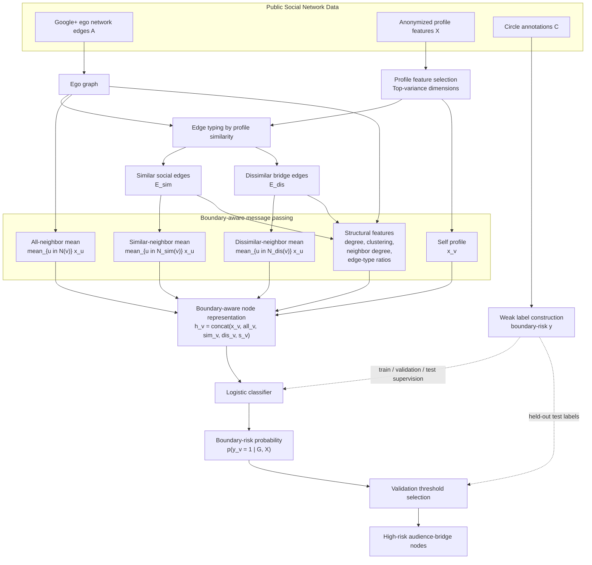
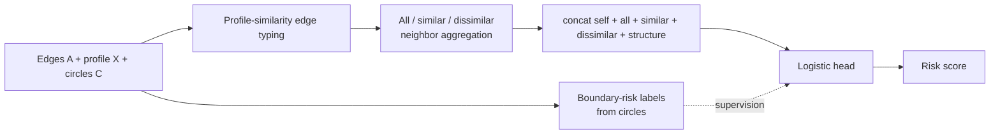

# BoundaryGNN-Logit Method Architecture

```mermaid
flowchart TB
    subgraph D["Public Social Network Data"]
        A["Google+ ego network edges A"]
        X["Anonymized profile features X"]
        C["Circle annotations C"]
    end

    C --> Y["Weak label construction\nboundary-risk y"]
    A --> G["Ego graph"]
    X --> F["Profile feature selection\nTop-variance dimensions"]

    G --> ETYPE["Edge typing by profile similarity"]
    F --> ETYPE
    ETYPE --> ESIM["Similar social edges\nE_sim"]
    ETYPE --> EDIS["Dissimilar bridge edges\nE_dis"]

    subgraph MP["Boundary-aware message passing"]
        SELF["Self profile\nx_v"]
        ALL["All-neighbor mean\nmean_{u in N(v)} x_u"]
        SIM["Similar-neighbor mean\nmean_{u in N_sim(v)} x_u"]
        DIS["Dissimilar-neighbor mean\nmean_{u in N_dis(v)} x_u"]
        STR["Structural features\ndegree, clustering,\nneighbor degree,\nedge-type ratios"]
    end

    F --> SELF
    G --> ALL
    ESIM --> SIM
    EDIS --> DIS
    G --> STR
    ESIM --> STR
    EDIS --> STR

    SELF --> H["Boundary-aware node representation\nh_v = concat(x_v, all_v, sim_v, dis_v, s_v)"]
    ALL --> H
    SIM --> H
    DIS --> H
    STR --> H

    H --> CLF["Logistic classifier"]
    CLF --> P["Boundary-risk probability\np(y_v = 1 | G, X)"]
    P --> T["Validation threshold selection"]
    T --> OUT["High-risk audience-bridge nodes"]

    Y -. "train / validation / test supervision" .-> CLF
    Y -. "held-out test labels" .-> T
```

## Compact Version

```mermaid
flowchart LR
    INPUT["Edges A + profile X + circles C"] --> LABEL["Boundary-risk labels\nfrom circles"]
    INPUT --> TYPE["Profile-similarity edge typing"]
    TYPE --> MSG["All / similar / dissimilar\nneighbor aggregation"]
    MSG --> REP["concat self + all + similar + dissimilar + structure"]
    REP --> LOGIT["Logistic head"]
    LOGIT --> RISK["Risk score"]
    LABEL -. supervision .-> LOGIT
```

